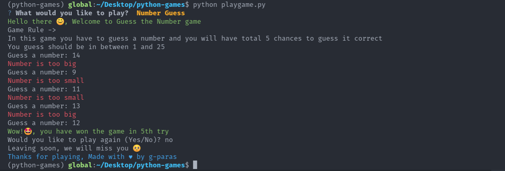

# Command Line Interface Game


### How to play these games

1. Clone this repository

```bash
git clone https://github.com/ishgervais/scam-game.git
cd scam-game
```

2. Install requirements

```bash
pip install -r requirements.txt
```

3. Start Game

```bash
python3 playgame.py
```

<!-- ### Sample play of Number Guess game -->

<!--  -->


<!-- #### Two additional modules are also used in this.

- `tinge` : for printing colored text in console
- `pyfiglet` : for ascii-art
- `PyInquirer` : interactive command line interface -->

<!-- #### Dependencies

```
Package        Version
-------------- ---------
pip            21.0.1
prompt-toolkit 1.0.14
pyfiglet       0.8.post1
Pygments       2.9.0
PyInquirer     1.0.3
regex          2021.4.4
setuptools     56.0.0
six            1.16.0
tinge          0.0.2
wcwidth        0.2.5
wheel          0.36.2
``` -->
